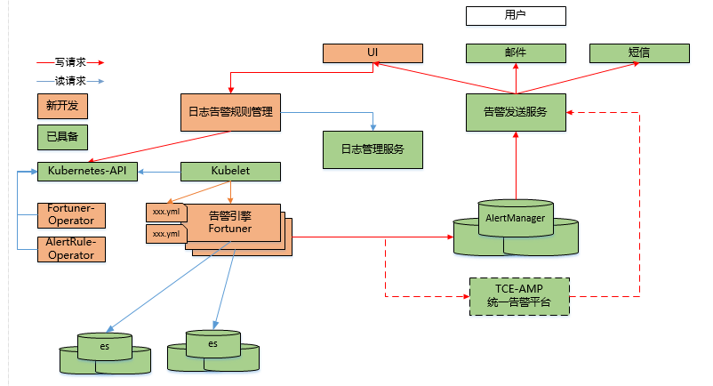

# fortuner

# Architecture


# Usage
```
Usage of /fortuner:
  -alert-ext-url string
    	external url for alert information (default "dev.yonghui.cn")
  -alert-resend-delay duration
    	min delay for one alert resend. (default 1s)
  -alertmanager-addr string
    	alertManager webhook url (default "http://10.211.160.34:9093")
  -alsologtostderr
    	log to standard error as well as files
  -distribution
    	is fortuner distribution deployed
  -evaluation-interval duration
    	interval for alert rule evaluation. (default 1m0s)
  -log_backtrace_at value
    	when logging hits line file:N, emit a stack trace
  -log_dir string
    	If non-empty, write log files in this directory
  -logtostderr
    	log to standard error instead of files
  -query-tail-time duration
    	default time range for tail of log. (default 30m0s)
  -rule-files-path string
    	path of rule files. (default "/usr/local/fortuner/rules/")
  -stderrthreshold value
    	logs at or above this threshold go to stderr
  -update-interval duration
    	interval for update rules. (default 10s)
  -v value
    	log level for V logs
  -vmodule value
    	comma-separated list of pattern=N settings for file-filtered logging

env:
only need if use -distribution

export REDIS_MODE=sentinel
export REDIS_HOSTS=172.16.74.176:6379,172.16.74.176:6379,172.16.74.176:6379,
export REDIS_PASSWD=123456
export REDIS_MASTER_NAME=mymaster
export REDIS_DB=0

run cmd:
./fortuner -v 3 -alsologtostderr --distribution
```

# How to build
```
git clone git@github.com:sak0/fortuner.git

cd fortuner

docker build .
```
